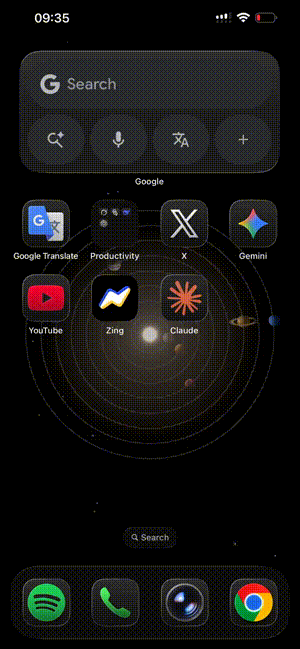

# OpenClaw Voice Commands

Connect Apple Siri to your OpenClaw/Clawdbot AI assistant.

```
"Hey Siri, OpenClaw"  →  Your Server  →  AI Response  →  Siri speaks
```

## Demo



<details>
<summary>Watch full demo</summary>

<video src="assets/demo.mp4" controls width="300"></video>

</details>

## Works Anywhere

| Platform | Example |
|----------|---------|
| VPS | Hetzner, DigitalOcean, AWS, Linode |
| Home Server | Mac Mini, Raspberry Pi, Linux box |
| Local | Same WiFi network |

## Features

- **Secure**: HTTPS, rate limiting, constant-time auth
- **Simple**: Pure Node.js, no dependencies
- **Modular**: Clean, composable code structure
- **Flexible**: Works on any platform running OpenClaw

## Quick Start

```bash
# 1. Clone
git clone https://github.com/marciob/openclaw-voice-commands.git
cd openclaw-voice-commands

# 2. Configure
export API_KEY=$(openssl rand -hex 32)
export CLI_COMMAND=clawdbot  # or 'openclaw'

# 3. Run
node index.js
```

Then create an [Apple Shortcut](docs/shortcut.md) to connect Siri.

## Documentation

| Doc | Description |
|-----|-------------|
| [Setup Guide](docs/setup.md) | VPS, Mac, Tailscale, local network |
| [Shortcut Guide](docs/shortcut.md) | Create the Apple Shortcut |
| [API Reference](docs/api.md) | HTTP endpoints |
| [Troubleshooting](docs/troubleshooting.md) | Common issues & fixes |

## Project Structure

```
├── index.js                  # Entry point
├── lib/
│   ├── config.js             # Configuration
│   ├── auth.js               # Authentication
│   ├── rate-limit.js         # Rate limiting
│   └── agent.js              # Agent runner
├── examples/
│   ├── Caddyfile.example     # HTTPS proxy (Linux)
│   ├── siri-bridge.service   # systemd (Linux)
│   └── com.openclaw.siri-bridge.plist  # launchd (macOS)
└── docs/
```

## Environment Variables

| Variable | Default | Description |
|----------|---------|-------------|
| `API_KEY` | required | Authentication key |
| `CLI_COMMAND` | clawdbot | `clawdbot` or `openclaw` |
| `PORT` | 18790 | Server port |
| `BIND_HOST` | 127.0.0.1 | Bind address |
| `AGENT` | main | OpenClaw agent ID |

## License

MIT
